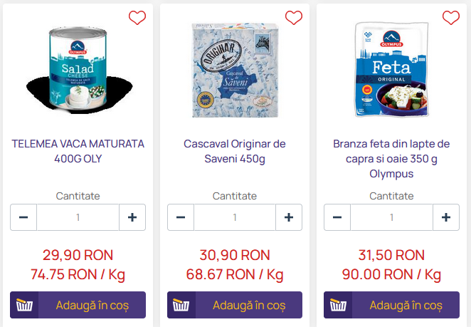

# Prezzuri Firefox Extension

## Overview

The "Prezzuri" Firefox extension automatically calculates and displays the price per kilogram for products listed on [Bringo.ro](https://www.bringo.ro/). This extension aims to make it easier for consumers to compare prices and make informed decisions while shopping for groceries online.

## Features

- Automatically calculates the price per kilogram for products.
- Supports dynamically loaded content.
- Easy to install and use.

## Installation

### From Firefox Add-ons Marketplace (Recommended)

- Soon..

### From Source

1. Clone this repository: `git clone https://github.com/yourusername/price-per-kg-extension.git`
2. Open Firefox and go to `about:debugging#/runtime/this-firefox`.
3. Click "Load Temporary Add-on" and select the `manifest.json` file from the cloned repository.

## Usage

1. Navigate to the [Bringo.ro](https://www.bringo.ro/) website and select your preferred store.
2. Browse through the products, and you will see the calculated price per kilogram displayed next to each product.

## License

This project is licensed under the MIT License - see the [LICENSE.md](LICENSE.md) file for details.
